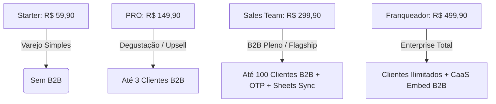

# 📊 Estudo Estratégico: Enquadramento e Monetização do Portal B2B

> **Data:** Agosto / 2026  
> **Status:** Aprovado  
> **Escopo:** Posicionamento de Preços, Monetização SaaS, Limites por Plano e Alavancas de Upsell / Retenção do Módulo B2B / Atacado.

---

## 🎯 1. Resumo Executivo & Decisão Estratégica

O **Módulo B2B / Portal Atacadista Privado** da PlataformaShop não é apenas um catálogo virtual — é uma **plataforma completa de negociação atacadista**, equipada com:
- Tabelas de preços personalizadas por cliente com sincronização via Google Sheets em tempo real.
- Sistema de ancoragem dinâmica de preços (cálculo de markup e economia de mercado).
- Segurança corporativa Passwordless (URL Sanitizer, WhatsApp OTP de 6 dígitos e Trusted Devices).
- Validação instantânea de CNPJ na base da Receita Federal (BrasilAPI).
- Pedido rápido em lote (*Fast Order*) com geração de comprovante e disparo no WhatsApp.

### 🏆 Decisão de Enquadramento:
O Módulo B2B é classificado como **Flagship Feature (Funcionalidade Estrela)** e será posicionado exclusivamente nos planos **Sales Team (R$ 299,90/mês)** e **Franqueador / All Service (R$ 499,90/mês)**, com uma camada de **Degustação Freemium no Plano PRO (R$ 149,90/mês)** como motor de tração de upgrades.

---

## 🔍 2. Benchmark de Mercado (Análise Competitiva)

Softwares nacionais e internacionais que oferecem soluções comparáveis de vendas B2B operam nas seguintes faixas de preço:

| Concorrente / Plataforma | Modelo de Cobrança | Preço Médio Mensal | Foco / Limitações |
| :--- | :---: | :---: | :--- |
| **Mercos B2B** | SaaS por Representante | R$ 380 a R$ 1.200/mês | Exige contratação por usuário vendedor. |
| **Meetime B2B / Ploomes** | CRM + Portal B2B | R$ 450 a R$ 900/mês | Foco corporativo pesado com onboarding complexo. |
| **Pedir.to Atacado** | SaaS Mensal | R$ 250 a R$ 600/mês | Catálogo simples com pedido em lote. |
| **VTEX B2B / Shopify Plus** | Enterprise | R$ 3.000 a R$ 15.000/mês | Grandes indústrias e marcas globais. |

> 💡 **Conclusão:** Oferecer um Portal B2B completo integrado ao ecossistema da PlataformaShop dentro de um plano de **R$ 299,90/mês** entrega um **Custo-Benefício Imbatível (High Value, Low Friction)** para distribuidores, atacadistas e franqueados.

---

## 📦 3. Matriz de Distribuição por Planos da PlataformaShop



### Detalhamento por Plano:

#### 1. Plano Starter (R$ 59,90/mês | R$ 39,90 anual)
* **Público:** Vendedores autônomos, prestadores de serviço e pequenos lojistas unitários.
* **Acesso B2B:** ❌ Não disponível.
* **Motivo:** O usuário do Starter busca apenas uma vitrine simples para vendas no varejo. Disponibilizar o B2B degradaria a percepção de valor da funcionalidade e geraria custos de suporte desproporcionais.

#### 2. Plano PRO (R$ 149,90/mês | R$ 99,90 anual)
* **Público:** Lojistas B2C consolidados com Bling ERP e domínio próprio.
* **Acesso B2B:** 🟡 **Degustação Controlada (Até 3 Clientes Homologados)**.
* **Objetivo de Negócio (Product-Led Growth):**
  - O lojista testa o módulo com seus 3 melhores clientes.
  - Ao atingir o 4º cliente, a plataforma exibe o modal de expansão: *"Você atingiu o limite de 3 parceiros B2B do Plano PRO. Faça upgrade para o Sales Team para cadastrar até 100 clientes e desbloquear sincronização com Google Sheets!"*.

#### 3. Plano Sales Team (R$ 299,90/mês | R$ 199,90 anual) — ⭐ **Plano Recomendado**
* **Público:** Distribuidores, atacadistas regionais, importadores e lojistas com equipe de vendas.
* **Acesso B2B:** ✅ **B2B Profissional Completo**.
* **Recursos Inclusos:**
  - Até **100 clientes B2B homologados** com Links Mágicos seguros.
  - Sincronização em tempo real via Google Sheets (Preços por SKU).
  - Validação de CNPJ automática via BrasilAPI / Receita Federal.
  - Segurança de Dispositivos Confiáveis (*Trusted Devices*) com WhatsApp OTP (6 dígitos).
  - Ancoragem dinâmica com markup personalizado por cliente.

#### 4. Plano Franqueador / All Service (R$ 499,90/mês | R$ 349,90 anual)
* **Público:** Redes de franquias, indústrias, marcas nacionais e grandes atacadistas.
* **Acesso B2B:** 🚀 **Enterprise Ilimitado**.
* **Recursos Inclusos:**
  - **Clientes B2B Ilimitados**.
  - Múltiplas planilhas integradas por departamento / filial.
  - **CaaS Embed B2B:** Incorporação do portal atacadista com preços protegidos em sistemas externos (portais de franqueados, intranets e e-commerces B2B legados).
  - Suporte prioritário e SLAs corporativos.

---

## 📈 4. Impacto nas Métricas SaaS (Unit Economics)

1. **Aumento do ARPU (Average Revenue Per User):**
   - O ticket médio da base de assinantes sobe de R$ 149 para a faixa de R$ 299 a R$ 499, impulsionado por compradores com alto volume de vendas.
2. **Redução Drástica do Churn (Taxa de Cancelamento):**
   - O portal B2B cria um **Lock-in Positivo**: quando os compradores do lojista se habituam a fazer pedidos pelo link exclusivo com ancoragem de preço, o custo de migrar para outro software se torna proibitivo.
3. **Conversão de Upsell Automatizada:**
   - O limite de 3 clientes no plano PRO atua como um gatilho orgânico e recorrente de upgrade sem necessidade de equipe de vendas interna (*Self-Service Expansion*).

---

## ⚙️ 5. Mapeamento Técnico de Implementação (`feature-matrix.ts`)

Para ativar essa regra no código, o `FeatureKey` `"b2b_portal"` será vinculado aos planos conforme abaixo:

```typescript
// lib/plans/feature-matrix.ts
export type FeatureKey =
  | "ai_seo"
  | "bling_sync"
  | "custom_domain"
  | "sales_team"
  | "bulk_pricing"
  | "caas_master"
  | "b2b_portal"; // Chave de liberação do portal atacadista
```

---

*Documento homologado e integrado à Base de Conhecimento Estratégica da PlataformaShop.*
