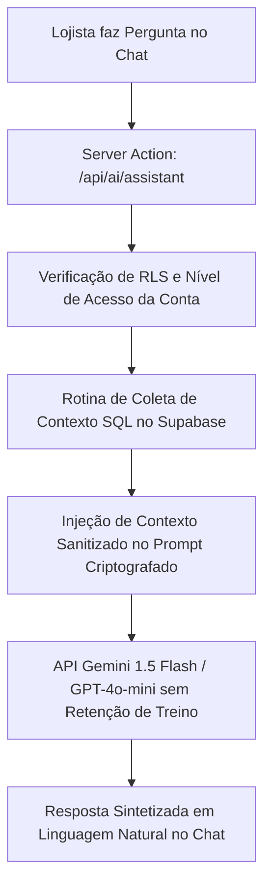

# Especificação Técnica: Assistente de Inteligência do Lojista (Chat RAG)

Este documento estabelece a arquitetura, o escopo funcional e as diretrizes técnicas para a implementação do **Assistente de IA para Lojistas**, projetado para o Plano Inter/PRO e Enterprise.

---

## 🎯 1. Objetivo do Recurso

Fornecer aos gestores e lojistas uma interface de linguagem natural no Dashboard capaz de responder a dúvidas operacionais sobre a sua própria loja em tempo real, tais como:
- **Estoque & Produtos:** *"Quais produtos estão com estoque abaixo de 5 unidades?"*, *"Qual o preço médio da categoria X?"*
- **Vendas & Leads (CRM):** *"Quantos leads novos entraram esta semana?"*, *"Qual o status dos atendimentos do vendedor Y?"*
- **Desempenho & Analytics:** *"Qual foi o produto mais consultado nos últimos 30 dias?"*

---

## 🏗️ 2. Arquitetura do Sistema (RAG Criptografado)

Para garantir segurança, isolamento estrito de dados por loja e resposta em tempo sub-segundo, a arquitetura utilizará **RAG (Retrieval-Augmented Generation)**:

### Componentes Técnicos:
1. **Engine de IA:** API Enterprise de baixa latência (ex: *Google Gemini 1.5 Flash*), configurada com flag de privacidade que **proíbe o uso de dados para treinamento de modelos**.
2. **Context Retrievers (Funções SQL no Supabase):** Conjunto de RPCs otimizados para extrair dados em formato JSON com filtro estrito de `organization_id`.
3. **Guardrails & Security Filters:** Sanitização para evitar *Prompt Injection* (tentativas do usuário de forçar a IA a ignorar regras ou revelar dados de outras lojas).

---

## 🔒 3. Segurança e Privacidade Estrita

- **Isolamento RLS:** Nenhuma consulta de contexto pode ser executada sem validar o `organization_id` da sessão ativa.
- **Zero Alucinação de Preços/Estoque:** A IA não tentará "adivinhar" dados. Se o contexto SQL não contiver a resposta, a IA informará: *"Não encontrei dados suficientes no seu painel para responder esta pergunta."*
- **Políticas de Custo/Quotas:**
  - Plano Starter: Acesso desativado.
  - Plano PRO / Inter: 100 perguntas / mês por conta.
  - Plano Enterprise: Perguntas ilimitadas.

---

## 💻 4. Interface do Usuário (UI/UX no Dashboard)

- **Widget Flutuante ou Aba dedicada em Analytics:** Painel com animações suaves (`framer-motion`), suporte a Dark Mode, histórico da sessão e botões de atalho rápido (ex: *"Resumo do dia"*, *"Alertas de estoque"*).
- **Formatos de Resposta:** Suporte a texto em markdown, tabelas comparativas e badges de status de produtos.

---

## 📅 5. Cronograma de Execução (Fase 2 - Pós-Lançamento)

| Etapa | Tarefas | Estimativa |
| :--- | :--- | :--- |
| **Etapa 1: Context SQL RPCs** | Criar funções Supabase para sumarizar estoque, leads e vendas em JSON. | 2 dias |
| **Etapa 2: Backend & Gateway IA** | Implementar a Server Action de RAG com sanitização e limite de quotas. | 2 dias |
| **Etapa 3: Componentes de UI** | Desenvolver a interface do chat com animações no Dashboard. | 3 dias |
| **Etapa 4: Homologação e Segurança** | Testes de carga, validação de isolamento RLS e ajuste de prompts. | 2 dias |
