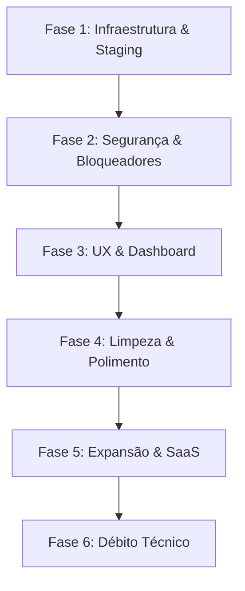

# Relatório de Pendências Organizado por Fases e Ordem Lógica

Este documento centraliza todas as tarefas, melhorias técnicas e auditorias pendentes estruturadas em uma ordem lógica de execução para o lançamento seguro da plataforma.

---

## 🚦 Fases de Execução e Prioridades

### 🚨 Bloqueadores de Lançamento Online (Go-Live)
*Lógica: Pendências de negócio, infraestrutura e autoridade visual essenciais para que a plataforma opere legal, financeiramente e esteticamente como um SaaS na internet pública.*
- [ ] **Assets Visuais & Mockups Oficiais da Landing Page (LP):** A Landing Page possui pendências de imagens em alta definição que afetam diretamente a conversão e a autoridade da marca no lançamento online:
  1. *Hero Mockup 3D Dark & Light (1200x900px WebP):* Mockups oficiais do aplicativo e cartão NFC físico em ambos os temas.
  2. *Logos Transparentes do Header (Dark & Light):* Logos oficiais vetorizadas em formato WebP para modo claro e escuro.
  3. *Ilustrações dos Blocos de Recursos B2B (4 cards):* Substituição das legendas de placeholder por gráficos/prints reais de Taxa Zero, Sincronização Bling ERP V3, NFC Híbrido e iFrame Embed.
  4. *Logos de Clientes/Parceiros Reais (6+ marcas):* Upload de 6+ empresas reais no CMS para ativação automática do carrossel marquee infinito.
- [x] **Autenticação de Dois Fatores (2FA / MFA via TOTP):** Obrigatoriedade de 2FA via App Autenticador (Google Authenticator, Authy, 1Password) no Portal Main Admin (`/main`), desafio AAL2 de sessão, banner de ação obrigatória no Perfil (`/dashboard/perfil?mfa_required=true`) e alertas educativos no Dashboard. *(SQL da tabela `user_2fa_backup_codes` e `user_mfa_backup_codes` validados no banco).*
- [x] **Gateway de Pagamento & Checkout (Kiwify & Sandbox):** Integração com Kiwify para checkout transacional com Taxa 0% e webhook automatizado (`/api/webhooks/kiwify`) validado por HMAC-SHA1. Suporte a repasse de `org_id` via parâmetros `s1`/`custom_variables`, ativação de planos (`starter`, `pro`, `sales_team`, `all_service`), estorno/cancelamento automático e ambiente Sandbox de testes instantâneos (`/sandbox-checkout/[plan_id]`).
- [x] **Infraestrutura de Identidade (E-mail SMTP & Domínio Vercel):** Módulo de e-mails transacionais (`lib/email/resend.ts`), templates HTML responsivos (`lib/email/templates.ts`), script de auditoria de variáveis (`scripts/audit_identity_infrastructure.js`) e guia completo de parametrização DNS/Resend SMTP (`[documentation]/infraestrutura/GUIA_CONFIGURACAO_DOMINIO_SMTP.md`).
- [x] **Políticas Jurídicas (LGPD e Termos):** Redigir e publicar páginas estáticas de "Termos de Uso" e "Política de Privacidade". Adicionar checkbox obrigatório "Li e aceito os termos" no formulário de cadastro.

### 🔹 Fase 1: Estabilização de Infraestrutura (Pré-requisito Crítico)
*Lógica: Precisamos de um ambiente de homologação seguro para testar qualquer alteração subsequente sem colocar os dados de produção em risco.*
- [ ] **(Prioridade Média) Separação de Ambientes Supabase (Staging vs Produção):** Criar um novo projeto no Supabase para Staging/Dev, aplicar as migrações existentes e configurar variáveis de ambiente locais e branches de preview da Vercel para este novo banco. Isso protegerá os dados reais após o lançamento.

### 🔹 Fase 2: Segurança de Acesso e Regras de Negócio
*Lógica: Garantir que a lógica de banco de dados (RLS) e regras para contas de usuários estejam blindadas antes de abrir para o público.*
- [x] **Auditoria no Cadastro de Catálogo B2C:** A lógica frágil de frontend foi substituída por uma Server Action blindada (`completeOnboarding`). Agora a criação de `organizations`, `profiles`, `catalogs`, `organization_catalogs` e `profile_catalogs` ocorre de forma atômica no backend no momento do onboarding, corrigindo os bugs de RLS e de catálogos "fantasmas" no primeiro acesso. *(Validado: Cadastro completo estruturado no backend, link público /p/[slug] abre imediatamente).*
- [x] **Validação do Google Auth:** Continuar o acompanhamento e validação do fluxo de "Entrar com Google" que atualmente apresenta erro de integração no Supabase (Unsupported provider) devido à pendência de configuração de chaves no painel.
- [x] **Recesso Temporário B2C ("Modo Férias"):** Criar a chave `is_accepting_orders` na tabela `profiles`. Atualizar RLS para permitir que o usuário ligue/desligue. Refletir o estado na UI do dashboard (Toggle em Configurações) e na vitrine pública (ocultar botões de "Comprar" ou exibir banner "Em recesso").
- [x] **Política de Cancelamento/Inadimplência:** Bloquear acesso ao painel ao fim do ciclo pago (mantendo apenas a tela de reativação/pagamento liberada). O catálogo público (`/p/[slug]`) deve exibir a tela de "Catálogo Temporariamente Indisponível" para preservar o SEO e o link. Implementar cronjob de exclusão de dados após 24 meses de inatividade (com aviso prévio por e-mail).

### 🔹 Fase 3: Refinamentos Críticos do Dashboard e Experiência do Usuário (Showstoppers UX)
*Lógica: O painel precisa estar 100% polido e funcional para os usuários logados.*
- [x] **Validação do Favicon (Simulação Super Admin):** Testado e validado o carregamento dinâmico no navegador ao alternar entre organizações simuladas.
- [x] **Sticker de Status da Assinatura:** Integar o sticker de "Status do Sistema" no TopHeader para exibir informações em tempo real sobre a assinatura do cliente (ex: "Assinatura Ativa", "Próxima ao Vencimento") com alertas sutis.
- [x] **Alerta Super Admin:** Ajustar o alerta de "Simulação de Dashboard" que aparece incorretamente ou precisa de refinamento na UX.
- [x] **Sino de Notificações:** Implementar funcionalidade real para o ícone de sino no dashboard (alertas de leads, sistema ou atualizações). Atualmente é apenas estético.

### 🔹 Fase 4: Limpeza e Polimento Geral (Pente Fino)
*Lógica: Remover qualquer vestígio de desenvolvimento antes do lançamento oficial.*
- [x] **Limpeza de Dados Fictícios:** Varredura total concluída (placeholders, textos de teste e vitrines limpas).

### 🔹 Fase 5: Conversão e Expansão Comercial (Pronto para o Mercado)
*Lógica: Atrair clientes para o SaaS e viabilizar a cobrança de planos.*
- [ ] **Landing Page de Captura:** Criar página oficial para conversão de novos clientes do SaaS.
- [x] **Sistemas de Pagamento:** Arquitetura de checkout Kiwify + Sandbox e webhooks atômicos implementada.
- [x] **Domínios Próprios:** Arquitetura de `custom_domain` automatizada via API da Vercel.
- [ ] **Assistente de Inteligência do Lojista (Chat RAG - Agendado Pós-Lançamento):** Arquitetura RAG isolada por `organization_id`, cotas mensais por plano (PRO/Enterprise) e especificações técnicas documentadas em [`[documentation]/planejamento/ESPECIFICACAO_CHAT_IA_RAG.md`](file:///c:/Users/Start/PlataformaShop/%5Bdocumentation%5D/planejamento/ESPECIFICACAO_CHAT_IA_RAG.md). Implementação agendada para a Fase 2 (Pós-Go-Live).
- [ ] **Análise Estratégica - Gestão de Acessos B2B:** Criação e validação do sistema de acesso de vendedores ao dashboard com as limitações configuradas pelo Gestor B2B.
- [ ] **Análise Estratégica - Planos e Funções:** Definição e criação de Planos e Funções (Roles) do SaaS.
- [ ] **Pesquisa de Mercado:** Estudo de precificação e análise de concorrência.

### 🔹 Fase 6: Débito Técnico e Monitoramento Secundário
*Lógica: Manutenção de longo prazo e qualidade estrutural de código.*

- [ ] **Auditoria de Tipagem:** Remoção de `any` e unificação de interfaces (`ProductRow`, etc.).
- [ ] **Auditoria de Tema:** Varredura de cores hardcoded e classes Tailwind residuais.
- [x] **Integração Bling (Sincronização de Estoque):** Sincronização manual pelo SKU implementada e validada.

---

## 🏆 Histórico de Itens Concluídos

### ✅ Infraestrutura e Super Admin (QG)
- [x] **Gestão Global de IA (Prompts e Modelos):** Criação de painel dedicado (`/main/ia`) para controle dinâmico de Prompts de SEO e Descrição, integrados à infraestrutura de configuração nativa.
- [x] **Tela de Gestão de Assinaturas & Financeiro no Super Admin (QG):** Página dedicada no painel global para gerenciar assinaturas, overrides de recursos e parametrização financeira.
- [x] **Gestão de Recursos (Super Admin):** Monitoração de consumo de tokens da IA (Gemini) integrada ao dashboard de infraestrutura.
- [x] **Teste de Desvinculação CaaS:** Validação do fluxo de permissão do Super Admin, edição no inquilino, geração do clone e restauração da versão mestre original.

### ✅ Segurança e Cadastro
- [x] **Segurança de Dados:** Relatório/auditoria sobre a segurança dos dados dos clientes (Criptografia, RLS, LGPD) em [RELATORIO_SEGURANCA_LGPD.md](file:///Users/macstudio-maj/Documents/Desenvolvimento/Aplicativos/PlataformaShop/RELATORIO_SEGURANCA_LGPD.md).
- [x] **Validação de Cadastro via OTP (E-mail):** Substituição do fluxo de link de confirmação por código numérico (OTP) de 6 dígitos e criação da tela de verificação no frontend.
- [x] **Validação Manual do Sistema OTP:** Teste completo de ponta a ponta e correção do frontend para aceitar códigos de 6 a 8 dígitos conforme enviado pelo Supabase.

### ✅ Catálogo, Produtos e Bulk Pricing
- [x] **Campo [Destaque do Produto]:** Campo de input no `ProductModal` (Dashboard), ativação via Botão Slider e exibição no Modal Público (trava de 35 chars e UPPERCASE).
- [x] **Inteligência Artificial (Filtro de Qualidade):** Review Modal para aprovação de sugestões com IA para Nome, Destaque e Descrição.
- [x] **Agrupamento por Categoria (Dashboard):** Organização dos produtos por categorias no admin.
- [x] **Ordenação Inteligente de Esgotados:** Opção global para enviar itens sem estoque para o fim de cada seção do catálogo.
- [x] **Tratamento de Órfãos:** Filtragem automática de produtos órfãos de catálogos excluídos.
- [x] **Gestão de Promoções em Massa (Bulk Pricing):** Migration SQL `apply_bulk_price_adjustment`, painel no Dashboard e regras de negócio com preview.
- [x] **Quebra de Texto em Cards Públicos:** Correção com `word-break: keep-all` nos cards públicos.

### ✅ Estética, Branding e Compartilhamento
- [x] **Revitalização do Cartão Público:** Design mais premium e menos neutro.
- [x] **Conexão Visual Dinâmica:** Herança de cores e logo do vendedor/empresa para o cartão.
- [x] **Validação: Catálogo Híbrido & WhatsApp Customizado:** Confirmação das migrations (`whatsapp_template` e `type`), substituição de template tags, seletor de tipo híbrido e SEO da vitrine.
- [x] **Social Share - Cartões e Produtos:** Botões de compartilhamento WhatsApp/Link para Cartão Público, Vitrine e Modal de Produto (OG Tags).
- [x] **Favicon:** Resolver o problema do ícone do navegador que ainda não está carregando corretamente. (Arquivo `public/favicon.ico` adicionado ao repositório). (MAJ)
- [x] **iFrame no Site Real (MAJ):** Resolução de redimensionamento e scroll automático usando script de `postMessage` e auto-resizer.
- [x] **Loader de Carregamento:** Indicador de progresso estético personalizado no carregamento do embed.
- [x] **Modal Expandido:** Exibição do modal de produtos totalmente expandida verticalmente, eliminando scrolls internos.
- [x] **Auditoria Mobile & Margens:** Padronização de margens mobile (`px-4`/`px-5`) e otimizações de responsividade.
- [x] **Suavização de Sombras:** Redução da agressividade do sombreamento (box-shadow) dos cards.
- [x] **Remoção de Seletor de Modelo de Negócio Obsoleto**
