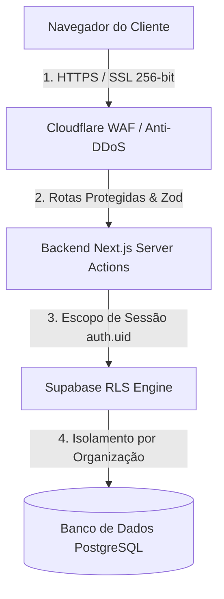

# 🛡️ Protocolo de Segurança e Defesa (PSD) - PlataformaShop

Este documento define as normas, arquiteturas e checagens de segurança obrigatórias para o **PlataformaShop**, garantindo proteção total a dados sensíveis, conformidade no processamento de pagamentos e isolamento multi-tenant no Supabase.

---

## 1. Arquitetura de Defesa em 4 Camadas



---

## 2. Pagamentos e Conformidade PCI-DSS (Risco Zero)

- **Processamento Delegado:** Todo o fluxo financeiro de pagamentos (Cartão de Crédito e Pix) é processado via gateways parceiros (Kiwify, Stripe, Asaas).
- **Sem Armazenamento Local:** NENHUM número de cartão de crédito, CVV ou validade passa pelos servidores ou banco de dados do PlataformaShop.
- **Webhooks Seguros:** O status da assinatura é atualizado via Webhooks autenticados por assinatura HMAC SHA-1 (`KIWIFY_WEBHOOK_SECRET`).

---

## 3. Banco de Dados & Supabase (Row Level Security - RLS)

- **RLS Obrigatório:** 100% das tabelas criadas no esquema `public` devem habilitar RLS:
  ```sql
  ALTER TABLE public.nome_da_tabela ENABLE ROW LEVEL SECURITY;
  ```
- **Isolamento Multi-Tenant:**
  - Tabelas de usuário (`profiles`): Leitura restrita ao próprio usuário, membros da mesma organização ou `main_admin`.
  - Tabelas da empresa (`organizations`): Apenas membros da empresa ou `main_admin` possuem acesso de leitura e escrita.
  - Tabela administrativa (`platform_admins`): Exclusiva para leitura e escrita por `main_admin`.
- **Proteção de Tokens OAuth e Chaves:** Colunas como `bling_access_token` ou `bling_refresh_token` na tabela `organizations` jamais são expostas para leitura pública.

---

## 4. Segurança em Webhooks e APIs

- **Assinatura HMAC SHA-1:** Todos os webhooks externos (ex: Kiwify) devem validar o cabeçalho `signature` antes de processar eventos.
- **Service Role Controlado:** O backend usa `SUPABASE_SERVICE_ROLE_KEY` estritamente no servidor. O uso de fallback para `ANON_KEY` em operações de escrita administrativa é proibido.
- **Sanitização Zod:** Todas as entradas de Server Actions e APIs HTTP são validadas na borda com esquemas estritos Zod.

---

## 5. Guia de Implementação Futura da Cloudflare (Produção)

Quando o projeto for para o domínio final de produção, a **Cloudflare (Plano Gratuito)** atuará como a primeira camada de defesa:

1. **Alteração de Nameservers (DNS):**
   - Apontar os servidores de DNS da sua registradora de domínio (ex: Registro.br ou GoDaddy) para os Nameservers da Cloudflare.
2. **Ativação de Proxy (Nuvem Laranja):**
   - Garantir que as entradas A / CNAME do domínio apontando para a Vercel estejam com o Proxy ativado (`Proxied / Nuvem Laranja`).
3. **Criptografia SSL/TLS:**
   - Configurar o modo de SSL/TLS para **Full (Strict)** na aba *SSL/TLS > Overview*, garantindo criptografia ponta a ponta.
4. **WAF (Web Application Firewall):**
   - Ativar o perfil de proteção contra robôs (*Bot Fight Mode*) na aba *Security > WAF*.
   - Criar regra de limitação de taxa (*Rate Limiting*) para rotas sensíveis como `/api/auth` e `/api/webhooks`.
5. **Proteção Anti-DDoS e HSTS:**
   - Ativar HSTS (*HTTP Strict Transport Security*) para forçar navegadores a se comunicarem apenas via HTTPS.

---

## 6. Auditoria de Segurança Automatizada

Para garantir conformidade constante sem depender de checagens manuais:
- **Script de Varredura SQL:** `node scripts/audit_security_rls.js` (Varre 100% das migrações SQL no repositório verificando tabelas sem RLS ou com políticas excessivamente permissivas).
- **Auditoria de Dependências:** `npm audit` integrado à esteira de desenvolvimento para detectar pacotes com vulnerabilidades conhecidas.

---

## 7. Checklist de Segurança Pré-Lançamento (Prod)

1. [x] 100% das tabelas SQL com RLS habilitado.
2. [x] Políticas de `profiles`, `organizations` e `platform_admins` restritas por organização/role.
3. [x] Endpoint de Webhook Kiwify protegido por HMAC SHA-1.
4. [ ] Apontar DNS do domínio para Cloudflare e ativar Proxy (Nuvem Laranja).
5. [ ] Configurar SSL/TLS **Full (Strict)** na Cloudflare.
6. [ ] Configurar `KIWIFY_WEBHOOK_SECRET` nas Variáveis de Ambiente da Vercel.
